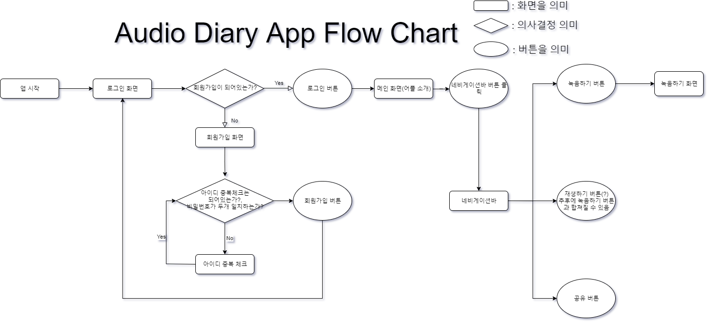

# 2020. 01. 23 Thu 회의 내용 (14:30~16:00)

- 앱 흐름도 디자인

### Audio Diary ( 어플 이름은 추후 결정 )

1. 회원가입 구현
2. 앱 흐름도 1차 구현완료

### 1차앱 흐름도(매번 업데이트)

### 정보

-  KaKao Oven 을 활용한 앱 UI 계획하기 - [카카오 오븐](https://ovenapp.io/)
- [파이어베이스를 활용한 로그인구현하기 2강까지 보시면 됩니다.](https://www.youtube.com/watch?v=ql6cFNVnpYA&list=PLjhvHI-lRYGrnOe4wQwm0xkX9O5Sm_Zat&index=1)

### 다음 회의까지 준비 되어야 할 것들

- KaKao Oven을 활용한 어플 UI 디자인 완료
- 회원가입 완료

